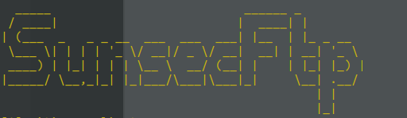
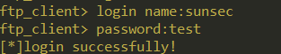

# sunsecFtp



此ftp分为服务端和客户端，是基于linux系统的c语言socket编程。基于tcp协议，服务端可以并行处理多个客户端的请求。

主要功能有

* 登陆
* 查看任意目录文件
* 上传文件
* 下载文件

服务端：

编译服务端时需要连接mysql的文件，同时在链接本地写好的mysq相关操作函数。一般的命令如下

```
gcc -I /usr/include/mysql server.c mysql_f.c -L /usr/lib/mysql/ -l mysqlclient -o server;./server
```

服务端的登陆模块使用了mysql，所以在运行服务器的机器上一定要有mysql。mysql的相关配置可以在``mysql_f.h``中修改。

客户端：

使用客户端时，常规的编译操作就可以。

```
gcc client_.c -o client
```

### 登陆

-------

登陆时，端口号在代码中已经指定，为8088,可以自行修改。所以用户只需要指定ip即可

```
login ip
```
之后就是输入用户名和密码



### 查看文件列表

-----

```
ls dir
```

只要是执行服务端的用户有权限访问的目录，都可以使用ls 查看目录

ls后面的目录路径不可忽略。

### 上传

------

```
put filepath/filename
```

客户端上传文件可以指定任意文件。只要是运行客户端的用户可以读的文件都可以上传。

在服务端，put以后的文件夹是同目录下的``files``，可以自行修改

### 下载

-------

```
get filepath/filename
```

下载文件也支持其他的目录。只要是执行服务端文件用户有读权限的文件，都可以下载，eg``/etc/passwd``等等。

客户端get以后的文件会放在同目录下的``download_files``下面，可以在代码中自行修改。
